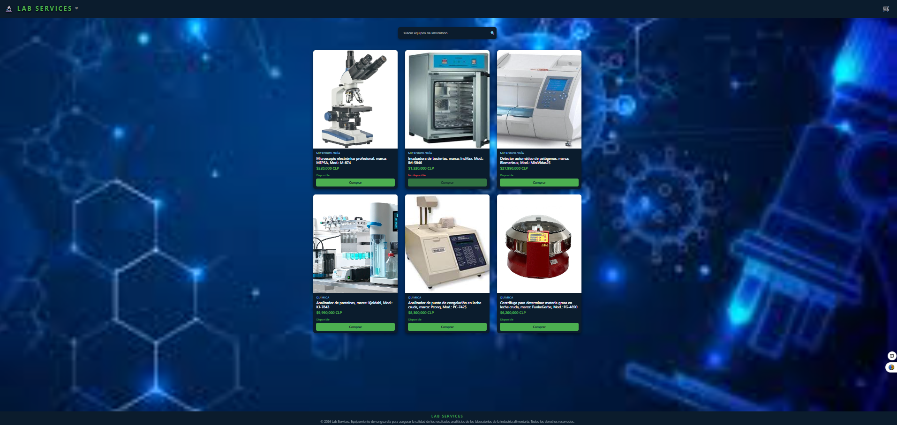
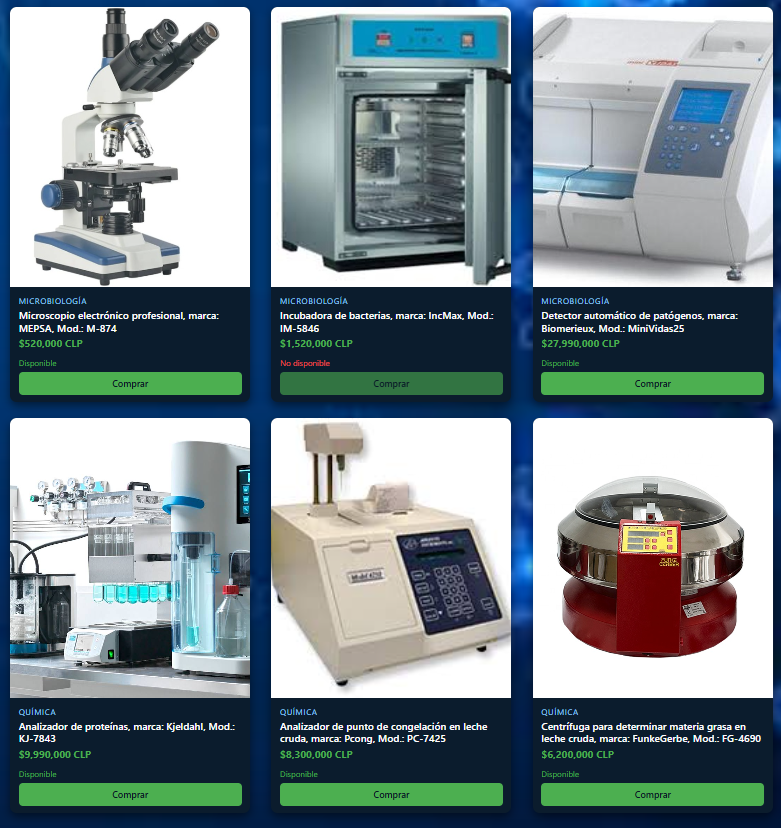
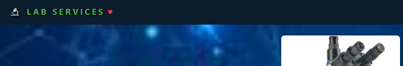

# 🔬 Lab-Services

Lab-Services es un e-commerce ficticio desarrollado con **React**, orientado a la venta de equipos de laboratorio, organizados en dos áreas principales: **Química** y **Microbiología**.

Actualmente se renderizan seis productos (tres por categoría), cada uno mostrado mediante tarjetas reutilizables (ProductCard).

La interfaz incluye:

- Header con logotipo, nombre de la tienda, ícono de carrito (sin funcionalidad aún) y un ícono de “me gusta” que cambia de estado y color utilizando useState.
- Background con imagen de fondo que actúa como layout contenedor.
- SearchBar, implementado como input controlado, que permite filtrar productos por nombre o categoría mediante estado (useState) gestionado en el componente Home.
- ProductList, responsable de renderizar dinámicamente el listado de productos usando map, e incluir un estado visual cuando no hay resultados.
- ProductCard, que muestra la información individual de cada equipo y utiliza un botón reutilizable (Button) para la acción “Comprar”, actualmente deshabilitado cuando no hay stock.
- Footer con información básica de la tienda.
El componente Home actúa como contenedor principal, gestionando el estado global de búsqueda y coordinando la renderización de los componentes principales.

---

## Componentes creados

1. Background
2. Button
3. Footer
4. Header
5. Home
6. ProductCard
7. ProductList
8. SearchBar

---
## ▶️ Instrucciones para ejecutar el proyecto

### 📌 Requisitos previos

Antes de ejecutar el proyecto, asegúrate de tener **Node.js** instalado.

Para verificarlo, ejecuta en la consola:

```bash
node --version
```

Si no está instalado, puedes descargarlo desde el sitio oficial:
👉 https://nodejs.org/en/download/

🚀 Pasos para ejecutar el proyecto

Desde la consola:

1. Clonar el repositorio: git clone <dirección-del-repositorio>

2. Ingresar al directorio del proyecto: cd lab-services

3. Instalar las dependencias: npm install

4. Ejecutar el proyecto en modo desarrollo: npm run dev


Una vez iniciado, el proyecto estará disponible en el navegador, normalmente en:
👉 http://localhost:5173

Hacer clic en el enlace con control pulsado, o copiar y pegar directamente en la barra del navegador.

---
## Tecnologías utilizadas

- React
- JavaScript (ES6+)
- CSS
- Vite

---
## 🖼️ Capturas del proyecto

### Vista principal


### Listado de productos


### Ícono de “me gusta” activado


---

## 🧩 Estructura de datos

Los productos se almacenan en un array con la siguiente estructura:

```js
{
  id: number,
  name: string,
  price: string,
  category: string,
  isAvailable: boolean,
  imageUrl: string
}
```
---